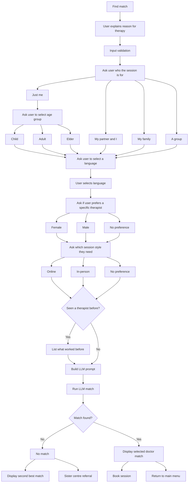

# Serenity Wellness Centre with AI-Powered Chatbot

This is a full website for a fictional wellness centre. It is centred on an AI-powered chatbot that matches patients to the best-suited therapist and handles real appointment booking end-to-end. Patients can also browse therapists manually if they prefer.

## Tech stack

**Frontend:** HTML, CSS, JavaScript

**Backend:** Flask, Flask-Mail

**Database:** MySQL

**AI:** Gemini API

## Purpose of this project
This project examines how AI engineering techniques, especially prompt engineering, can enhance business efficiency and customer outcomes using AI chatbots. The focus is on a practical application in the health care sector: a mental wellness chatbot designed to improve client-therapist matching. Clients often book mainly based on availability. This can lead to a mismatch in clinical needs. Addressing this gap boosts client satisfaction, which could ultimately drive revenue growth.

## Approach
Below is a flow diagram used to outline the main flow of the SerenityBot for the website.

